# 大学生恋爱数据分析

## 研究背景

感情这个奇妙的东西，也许是世界上最撩拨人心弦的事物了吧。大学的我们，正值情窦初开的年龄，丢掉了高考的包袱，多了无限的自由时间，校园生活中共同学习、生活和交流过程中，兴趣爱好、思想观念相同的同学们组成各种各样的学生组织。这形形色色的人中，一定有你想要冲破荆棘，共同扶携，互换余生的人吧！为了了解大学生的恋爱状况，对恋人的期望和自身的特质，大学校园中影响恋爱的环境因素，探究影响大学生恋爱的因素，看看有没有什么有趣的发现，也希望能够为还在观望别人恋情的大学生提供参考。

## 数据资料

基于狗熊会的数据资料库，从中获得了大学生的恋爱数据，该数据是以问卷调查的形式获取了711位大学生的恋爱数据。数据库提供了每一位调查者的单身情况、追求与被追求经历、恋爱次数、社交团体、个人才艺、恋爱的主要消费、对恋人的要求等资料。

下面我们考虑以下一些可能对恋爱次数有影响的因素：

性别，男性女性分别记为1，2；

不同年级，大一、大二、大三、大四、硕士及以上分别记为1，2，3，4，5；

是否有才艺与是否在学生组织中任职，没有和有分别记为1，2；

对于剩下的变量进行建立数学模型：

对恋爱中的主要消费和注重恋人的方面以及恋人注重自身的方面分析各个选项的权重，分别建立新变量恋爱花费系数、注重恋人指数和恋人注重指数，进一步分析三者之间的关系。

## 对于数据的初步解读

### 考察恋爱次数

 

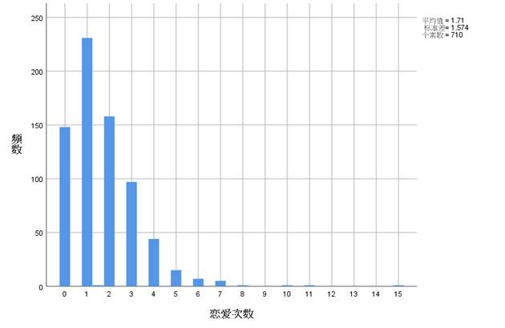

**图** **1****恋爱次数直方图**

由条形图可以看出大学生恋爱次数只要集中在0、1、2、3。仍有一部分的大学生没有谈过恋爱。

### 追与被追与性别的关系

 

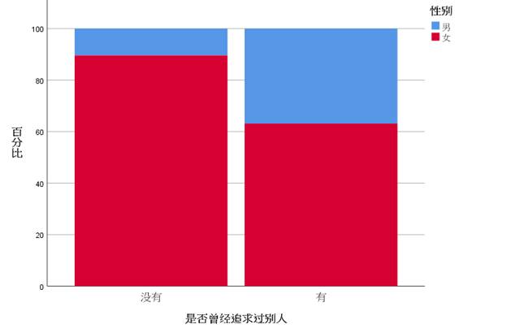

**图** **2****有无追求他人经历的性别比例**

从图中可以看出，女生追求别人的百分比竟然大于男生。 

 

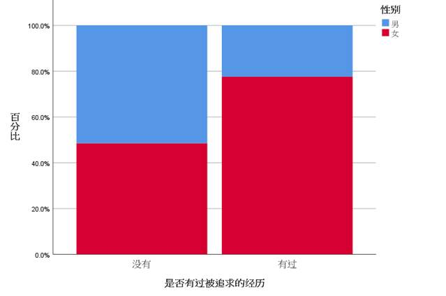

**图** **3****有无被追求经历的性别比例**

大部分女生都有过被追求的经历，而男生较少。

### 主动与被动

 

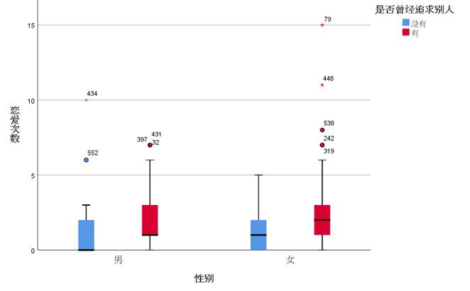

**图** **4****主动性对恋爱次数影响的箱线图**

男女都是，没有追求过别人的恋爱次数较少。

 

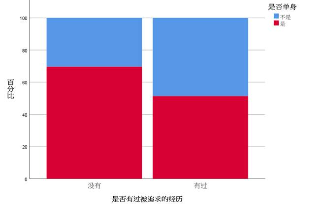

**图** **5****有无被追求经历的单身比例**

有过被追求经历的人当下不是单身的概率比没有过被追求经历的人相比较大。

 

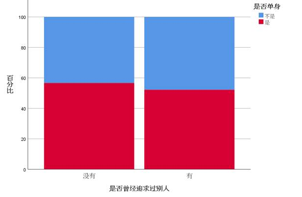

**图** **6****有无追求他人经历的单身比例**

是否追求过别人和当下是否单身的概率无关。追求过别人和没有追求过别人的现在单身的概率几乎相同。

### 社交团体、才艺、学生会任职的影响

 

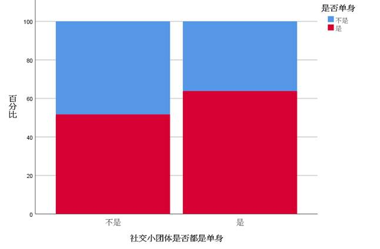

**图** **7****社交团体不同单身情况下自身单身的比例**

可见社交团体中，如果社交团体中都是单身自身单身的概率较大，如果社交团体都不是单身， 那自己不是单身的概率也相对提升，但是效果不太明显，可见社交团体的恋爱状态和自己是否单身关系不大。

 

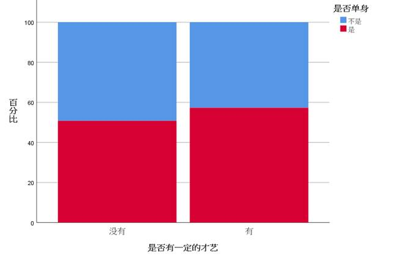

**图** **8****是否有才艺时的单身比例**

有才艺的人单身概率小于没有才艺的人。

 

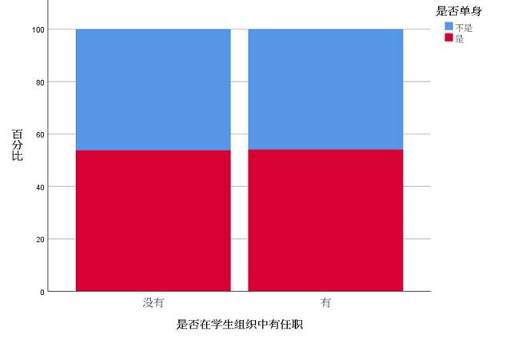

**图** **9****是否在学生组织任职时的单身比例**

在学生会中是否任职不会影响现在是否单身。

 

### 恋爱中主要消费

 

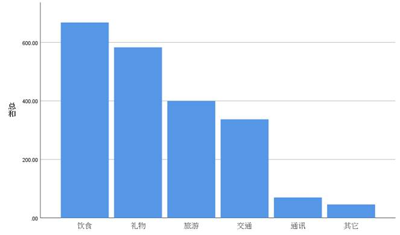

**图** **10****消费类别条形图**

由图可得饮食和礼物是恋爱中的主要消费。

### 将自身注重&注重恋人的方面合并分析（分男女）

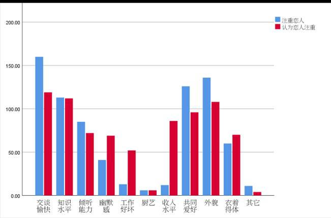

**图** **11****男性自身注重****&****注重恋人方面的簇状条形图**

 

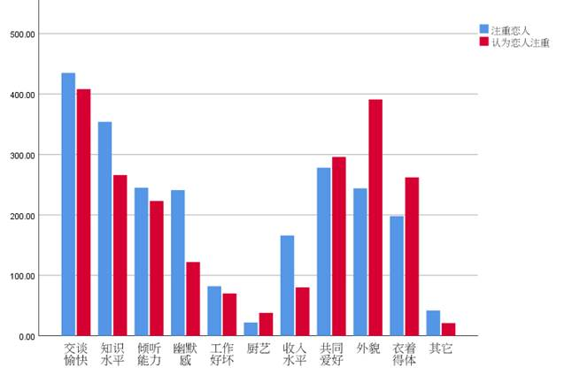

**图** **12****男性自身注重****&****注重恋人方面的簇状条形图**

 

## 研究目标

通过假设性检验、方差检验检查恋爱次数和才艺、是否参加学生会等外部条件的联系。通过拟合线性回归方程检验男女双方恋爱因素的线性关系。

## 数据分析

### 假设性检验

#### 对平均恋爱次数的假设

**表** **1****平均恋爱次数的假设性检验结果**

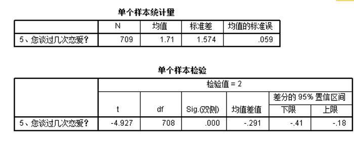

​    其中，μ为平均恋爱次数

\1.     由上图表一可以看出，大学生谈过恋爱次数的平均值为1.71，标准差为1.574，均值的标准误为0.059

\2.     由上图表二可以看出，检验值为2，样本均值与检验值的差为0.29，检验统计量的观察值为-4.927，输出结果中的“Sig.(双侧)”即为检验的p值，由于p值 = 0.000 < 0.01，表面我们有充分的理由拒绝原假设，即有充分的理由认为学生的平均恋爱次数为2与实际平均恋爱次数有显著差异

 

#### 分析性别对恋爱次数的影响

**表** **2****性别对恋爱次数的的假设性检验结果**

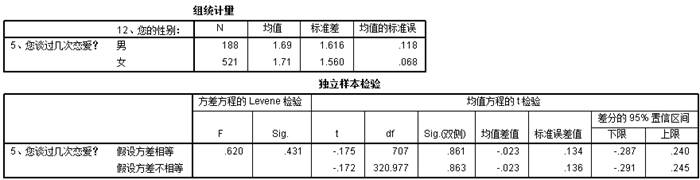

其中，为男同学的恋爱次数，为女同学的恋爱次数

\1.     上图表一为两组样本的基本统计量，由此可以看出，男同学组和女同学组的均值和标准差有一定差距，但差别不大

\2.     在表二中，我们先看方差是否相等的检验，采用的使Levene F检验，检验的显著性水平“Sig.”(即p值)等于0.431，如果采用的显著性水平为0.1，意味着我们没有充分的理由拒绝原假设，即认为两总体的标准差相等，因此采用加权两样本t检验(情形Ⅱ)，即第一行的“假设方差相等情形”的结果

\3.     检验统计量的值为-0.175，自由度df为707，双侧检验的p值为0.861 > 0.1，因此我们没有充分的理由拒绝男女恋爱次数相等的原假设，即男女的恋爱次数并无显著差异

### 方差分析

#### 不同年级对恋爱次数是否有显著差异

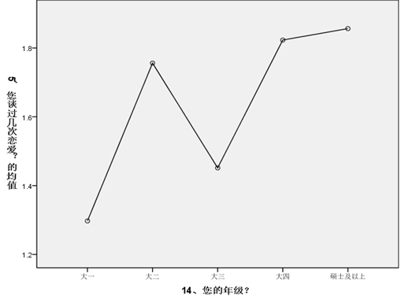

**图** **13****恋爱次数均值关于年级的折线图**

**表** **3****单因素方差分析结果****1**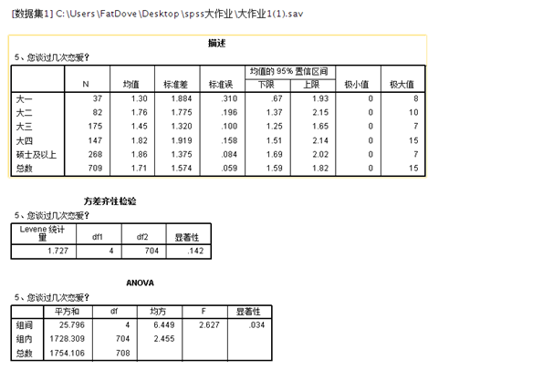

**表** **4****单因素方差分析结果****2**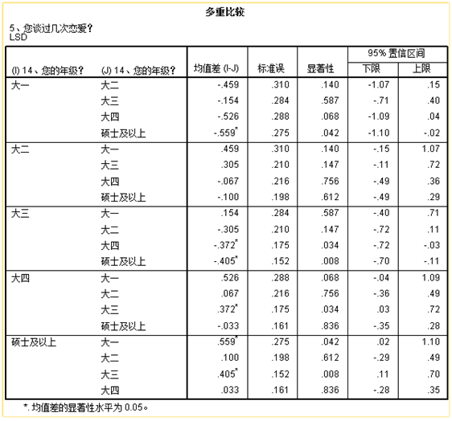

\1.     描述表给出了不同年级的谈过恋爱次数的样本量、样本均值、标准差、标准误以及各个总体均值的置信水平为95%的置信区间等描述性信息

\2.     方差齐性检验表给出了方差齐次性检验的结果，表中最后一列即为检验的p值，等于0.142，因此在显著性水平0.05下，可以认为模型中的各个总体方差是齐次的

\3.     ANOVA表为方差分析表，最后一列即为检验的p值，等于0.034，在显著性水平0.05下，应拒绝原假设，认为5个年级的恋爱次数存在显著差异，即考察因素是显著的，但是无法判断那几个总体的均值是不同的，因此采用多重比较进一步讨论

\4.     由折线图可以直观地反映均值的变化情况

\5.     多重比较采用LSD法，从中可见，大三和硕士及以上的p值很小，也就说明这两者均值差异较大，大一和大四、大一和硕士及以上、大三和大四的p值也相对较小

\6.     由方差分析表得出在显著性水平0.05下，应拒绝原假设，认为5个年级的恋爱次数存在显著差异，但从折线图和多重比较表都可以得出大四和硕士及以上学历的恋爱次数无显著差异，而大三和硕士及以上的恋爱次数存在显著不同，大三恋爱次数均值比硕士及以上要低，由此可以对照恋爱次数在一定程度上判断年级

#### 是否有才艺与是否参加学生会对恋爱次数的影响

**表** **5****才艺与是否参学生会对恋爱次数的多因素方差分析结果**

*由表，可知才艺影响显著*

\1.     从主体间因子表可见出题中两个元素是否有才艺和是否在学生会任职均为两个水平

\2.     在主体间效应检验分析列表中，可以看到是否具有才艺、是否学生会任职、是否具有才艺*是否学生会任职的显著性数值，根据国际衡量值0.05可知，其中只有是否具有才艺具有明显的显著性，具有可继续研究的价值，其余不具有明显显著性，没有继续研究价值

### 线性分析

#### 变量与处理

由于我们的初始数据都是分类数据，每个因素的值不是1就是0，所以很难进行线性分析，于是我们想到建立数学模型，对已有变量进行建模，生成新的变量，以便进行线性分析

首先我们可以将“恋爱中主要消费”的多选列进行分析，分析每个选项的权重情况

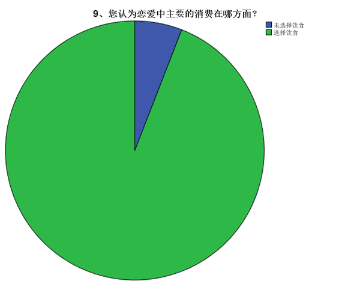

**图** **14****是否选择饮食的饼状图**

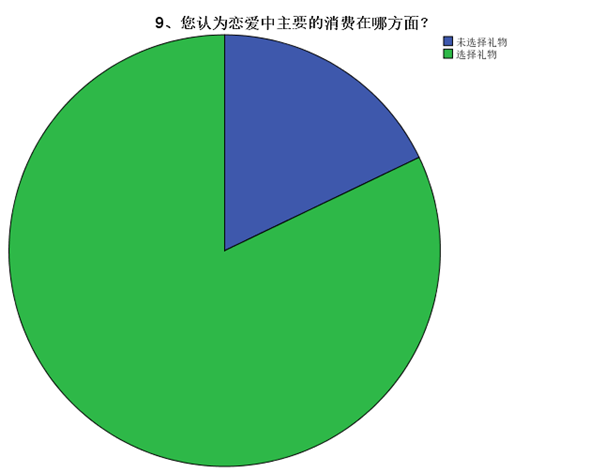

**图** **15****是否选择礼物的饼状图**

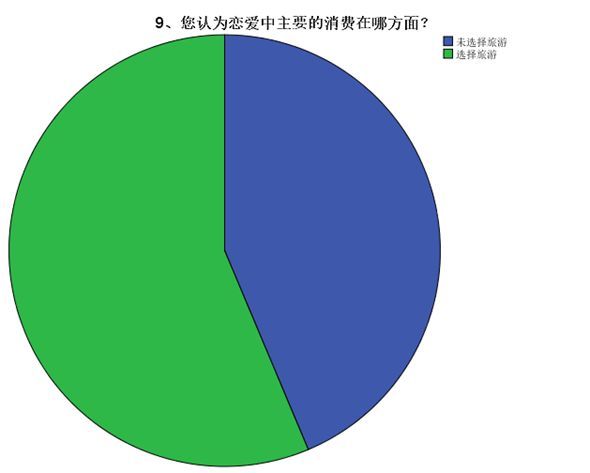

**图** **16****是否选择旅游的饼状图**

**图** **17****是否选择交通的饼状图**

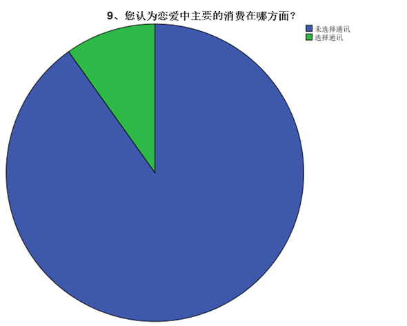

**图** **18****是否选择通讯的饼状图**

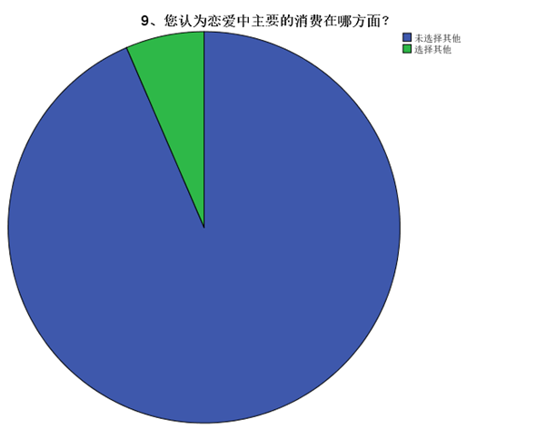

**图** **19****是否选择其他的饼状图**

频率表如下：

**表** **6****各因素的频率表**

 

可以发现选择饮食占据了大多数，其次是礼物，旅游，交通通讯其他在多选中占比较少

所以可以进行数学公式模拟，设置变量，恋爱中花费系数 = 因素x频率

可得恋爱中花费系数 = 饮食x94.1+礼物x82.1+旅游x56.3+交通x47.5+通讯x9.9+其他x6.5

同理，构建变量注重恋人系数（男生对女生）

**表** **7****注重恋人方面的频率表****1**

**表** **8****注重恋人方面的频率表****2**

构建恋人注重系数（女生对男生）：

**表** **9****认为恋人注重恋人方面的频率表****1**

**表** **10****认为恋人注重恋人方面的频率表****2**

 

**表** **11****认为恋人注重恋人方面的频率表****3**

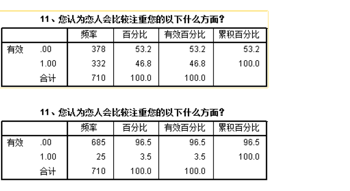

**图** **20****注重系数计算**

我们得到如下三列数据：

**图** **21****注重系数部分结果**

#### 进行一元线性分析——注重恋人系数与恋人注重系数的一元线性关系

**表** **12****一元线性回归结果**

\1.     表一为回归分析的一般说明，指出了自变量是恋人注重系数，因变量是注重恋人系数，回归选择的方法是所有变量直接进入模型

\2.     表二给出了模型的指标，回归方程的相关系数为0.566，判定系数为0.320，与1相差较远，说明因变量的变异有56.6%是自变量引起的，给出的估计值为47.56140

\3.     表三为模型线性关系检验的结果，其中检验统计量的值F = 333.131，最后一列计算了检验的p值为0.000，这表明线性回归方程是显著的，即注重恋人系数对恋人注重系数在统计意义下具有显著的线性关系

\4.     表四是回归系数表，由此可以得到线性回归方程为(x：恋人注重系数，y：注重恋人系数)

#### 进行多元线性分析——注重恋人指数与恋人注重指数对恋爱花费系数的多元线性分析

**表** **13****多元线性回归结果****1**

**表** **14****多元线性回归结果****2**

\1.     表一为回归分析的一般说明，指出了自变量是恋人注重系数和注重恋人系数，因变量是恋爱花费系数，回归选择的方法是所有变量直接进入模型，回归的选择方法为向前

\2.     表二给出了模型整体拟合效果，其多元决定系数为0.55，修正的多元决定系数为0.54，说明恋人注重系数对于因变量的解释度一般，再加上注重恋人系数后多元决定系数的变化不大，说明注重变量系数对因变量的影响很小

\3.     表四的最后两列的两个自变量恋人注重系数和注重恋人系数的容差均为

\4.     0.680 > 0.1，VIF = 1.471 < 10，说明恋人注重系数和注重恋人系数不存在多重共线性

 

## 对大学生恋爱数据的总结

\1.     有充分的理由认为学生的平均恋爱次数为2与实际平均恋爱次数有显著差异

\2.     男女的恋爱次数并无显著差异

\3.     大四和硕士及以上学历的恋爱次数无显著差异，而大三和硕士及以上的恋爱次数存在显著不同，大三恋爱次数均值比硕士及以上要低，由此可以对照恋爱次数在一定程度上判断年级

\4.     是否具有才艺对恋爱次数有显著影响

\5.     注重恋人系数对恋人注重系数在统计意义下具有显著的线性关系，可以得到线性回归方程为(x：恋人注重系数，y：注重恋人系数)

y=115.827+0.532*x

​         \6.   恋人注重系数和注重恋人系数对恋爱花费系数的影响很小。恋人注重系数和注重恋人系数不存在多重共线性

 